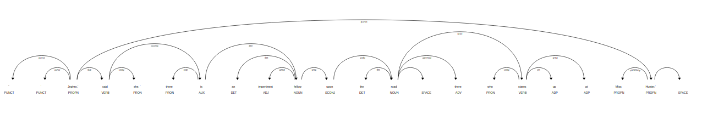

Title: Intro to Naural Language Processing with spaCy
Date: 10-07-2019
Slug: blog-3

## spaCy

spaCy is a natural language processing library for python. Some of its features are:
- non-destructive tokenization,
- named entity recognition,
- pre-trained models
- support for 52+ individual langueages.

Since coding is best explained through examples, in this blog, we will use spacy to work through a book from [Project Gutenberg](http://www.gutenberg.org/ebooks/1661).

### Finding proper nouns and custom patterns in The Adventures of Sherlock Holmes

#### Install spacy and language model


```python
! pip install -U spacy
! python -m spacy download en_core_web_sm
```

#### Imports


```python
import spacy
```

#### Load model as the nlp onject

spacy language and models can be downloaded as python packages. Some of the models and langugae packages can be found [here](https://spacy.io/usage/models). For this example, we will be using the small english languge web model 'en_core_web_sm'.


```python
nlp = spacy.load('en_core_web_sm')
```

#### Load text


```python
text = open('data/1661-0.txt').read()
```

The length of the text is more than the default max length, so we reassign the max length of text to reflect that.


```python
nlp.max_length = len(text)
```

#### Process text


```python
doc = nlp(text)
```

#### Find sentences in text


```python
sentences = list(doc.sents)
```

we can access the sentences through a loop.


```python
long_sentences = [sentence for sentence in sentences if len(sentence) > 100]
long_sentences[0]
```


    A shock of orange hair, a
    pale face disfigured by a horrible scar, which, by its contraction, has
    turned up the outer edge of his upper lip, a bulldog chin, and a pair
    of very penetrating dark eyes, which present a singular contrast to the
    colour of his hair, all mark him out from amid the common crowd of
    mendicants and so, too, does his wit, for he is ever ready with a reply
    to any piece of chaff which may be thrown at him by the passers-by.


#### Tokenization, Lemmatization and labeling of named entities

When we call the nlp object on our text, it calls for a pipeline object that tokenizes, tags, parses and recognizes entities. We can access the tokens and entities through a loop, call for the lemmas of each word through .lemma_ and find labels for the entities through .label_


```python
token_list = [token for token in doc]
token_list[1000:1010]
```


    [problem, ., I, rang, the, bell, , and, was, shown]


```python
lemma_list = [token.lemma_ for token in doc]
lemma_list[1000:1010]
```


    ['problem', '.', '-PRON-', 'ring', 'the', 'bell', '\n', 'and', 'be', 'show']


```python
entity_list = []
label_list = []
for ent in doc.ents:
    entity_list.append(ent)
    label_list.append(ent.label_)
i = 0
while i < 10:
    print(entity_list[i], ':', label_list[i])
    i += 1
```

    Gutenberg : PERSON
    The Adventures of Sherlock Holmes : WORK_OF_ART
    Arthur Conan Doyle

     : ORG
    the Project Gutenberg License : ORG
    eBook : LAW
    The Adventures of Sherlock Holmes

     : WORK_OF_ART
    Arthur Conan Doyle

    Release Date : PERSON
    November 29, 2002 : DATE
    May 20, 2019 : DATE
    English : LANGUAGE


As we can see, it's not perfect. Often times, for bigger text documents like this it is better to use larger models. 'en_core_web_sm' is a smaller model, as denoted by the 'sm' suffix.

#### Find all the proper nouns in the text


```python
proper_noun_list = [token.text for token in doc if token.pos_ == 'PROPN']
print('Number of proper nouns in text:', len(proper_noun_list))
print('Example:', proper_noun_list[1537:1550])
```

    Number of proper nouns in text: 5070
    Example: ['Miss', 'Turner', 'James', 'Mr.', 'Holmes', 'Miss', 'Turner', 'God', 'Holmes', 'Lestrade', 'James', 'McCarthy', 'Holmes']


The proper nouns can also be accessed through loops.

#### Stop words

Stop words and punctuations can be targeted through is_stop and is_punct.


```python
clean_doc = [token.text for token in doc if (not token.is_stop) and (not token.is_punct)]
clean_doc[0:10]
```


    ['\n',
     'Project',
     'Gutenberg',
     'Adventures',
     'Sherlock',
     'Holmes',
     'Arthur',
     'Conan',
     'Doyle',
     '\n\n']


We can use our own stop_words or make a default stop_word not a stop_word with in the following [process](https://stackoverflow.com/questions/41170726/add-remove-stop-words-with-spacy).


```python
nlp.vocab["the"].is_stop = False
nlp.vocab["\n"].is_stop = True
clean_text = [token.text for token in doc if (not token.is_stop) and (not token.is_punct)]
clean_text[0:10]
```


    ['Project',
     'Gutenberg',
     'Adventures',
     'Sherlock',
     'Holmes',
     'Arthur',
     'Conan',
     'Doyle',
     '\n\n',
     'eBook']


#### dependencies and visualization through displacy


```python
# Print the text and the predicted part-of-speech tag
import pandas as pd
print('Sentence:',sentences[637])
sent_df = pd.DataFrame(columns = ['text', 'pos', 'dep', 'related word'])
text_list = []
pos_list = []
dep_list = []
rel_list = []
for word in sentences[637]:
    text_list.append(word.text)
    pos_list.append(word.pos_)
    dep_list.append(word.dep_)
    rel_list.append(word.head.text)
sent_df['text'] = text_list
sent_df['pos'] = pos_list
sent_df['dep'] = dep_list
sent_df['related word'] = rel_list
sent_df
```

    Sentence: I wish she had been of my own station!


<div>
<style scoped>
    .dataframe tbody tr th:only-of-type {
        vertical-align: middle;
    }

    .dataframe tbody tr th {
        vertical-align: top;
    }

    .dataframe thead th {
        text-align: right;
    }
</style>
<table border="1" class="dataframe">
  <thead>
    <tr style="text-align: right;">
      <th></th>
      <th>text</th>
      <th>pos</th>
      <th>dep</th>
      <th>related word</th>
    </tr>
  </thead>
  <tbody>
    <tr>
      <th>0</th>
      <td>I</td>
      <td>PRON</td>
      <td>nsubj</td>
      <td>wish</td>
    </tr>
    <tr>
      <th>1</th>
      <td>wish</td>
      <td>VERB</td>
      <td>ROOT</td>
      <td>wish</td>
    </tr>
    <tr>
      <th>2</th>
      <td>she</td>
      <td>PRON</td>
      <td>nsubj</td>
      <td>been</td>
    </tr>
    <tr>
      <th>3</th>
      <td>had</td>
      <td>AUX</td>
      <td>aux</td>
      <td>been</td>
    </tr>
    <tr>
      <th>4</th>
      <td>been</td>
      <td>AUX</td>
      <td>ccomp</td>
      <td>wish</td>
    </tr>
    <tr>
      <th>5</th>
      <td>of</td>
      <td>ADP</td>
      <td>prep</td>
      <td>been</td>
    </tr>
    <tr>
      <th>6</th>
      <td>my</td>
      <td>PRON</td>
      <td>poss</td>
      <td>station</td>
    </tr>
    <tr>
      <th>7</th>
      <td>own</td>
      <td>ADJ</td>
      <td>amod</td>
      <td>station</td>
    </tr>
    <tr>
      <th>8</th>
      <td>station</td>
      <td>NOUN</td>
      <td>pobj</td>
      <td>of</td>
    </tr>
    <tr>
      <th>9</th>
      <td>!</td>
      <td>PUNCT</td>
      <td>punct</td>
      <td>wish</td>
    </tr>
    <tr>
      <th>10</th>
      <td>\n</td>
      <td>SPACE</td>
      <td></td>
      <td>!</td>
    </tr>
  </tbody>
</table>
</div>


```python
from spacy import displacy
displacy.render(sentences[6751], style = 'dep')
```

Here's what the visualizer would render for us.


While the code block mentioned above is enough to render displacy in jupyter notebook, we need to use displacy.serve for other cases.

#### Matcher

So if we wanted to extract every word group that consisted of a noun following an adjective, how would we do that?

We can use Rule based matching to accomplish this.


```python
sentences[6751]
```


    “‘Jephro,’ said she, ‘there is an impertinent fellow upon the road
    there who stares up at Miss Hunter.’


Import matcher.


```python
from spacy.matcher import Matcher
```

Instantiate the matcher with shared vocab of the doc.


```python
matcher = Matcher(nlp.vocab)
```

Create a custom pattern and add it to the matcher.


```python
pattern = [{'POS': 'ADJ'},
           {'POS': 'NOUN', 'OP': '+'}]
matcher.add('CUSTOM_PATTERN', None, pattern)
```

note: "OP" can have one of four values:
- '!' for 0 times
- '?' for 0 or 1 time
- '+' for 1 or more times
- '*' for 0 or more times

We can add pattern to the matcher as well thorugh matcher.add()


```python
matches = matcher(doc)
len(matches)
```


    3202


We can access the matched spans through loops.


```python
match_list = [doc[start:end] for match_id, start, end in matches]
match_list[100:105]
```


    [other purposes, private note, own seal, little problem, serious one]


There's a lot more we can do with spacy, it is really well [documented](https://spacy.io/usage/spacy-101) and easy to pick up. So if you're looking to do some more NLP alongside what [nltk](https://www.nltk.org/) has to offer, check out spacy!
